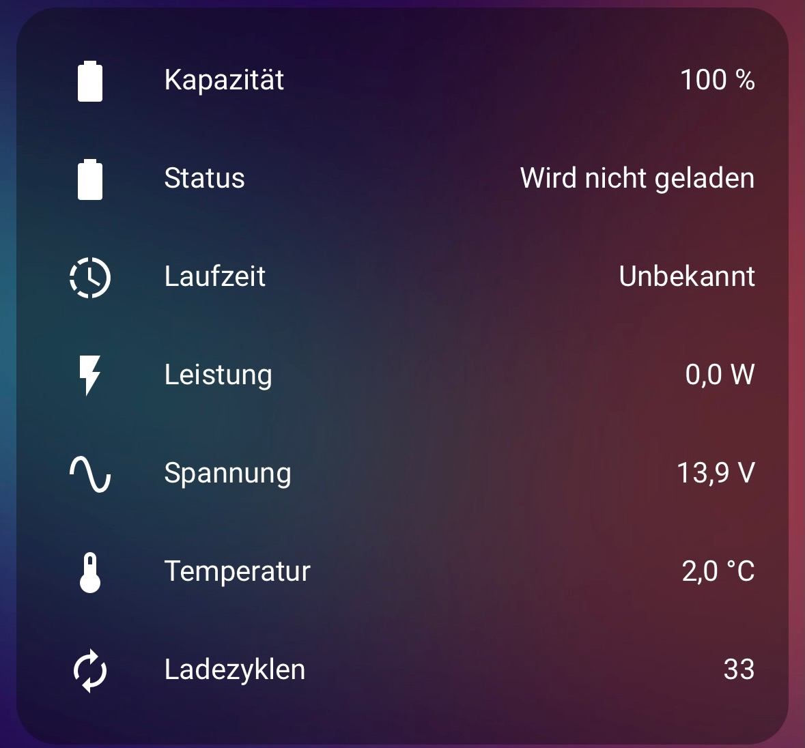
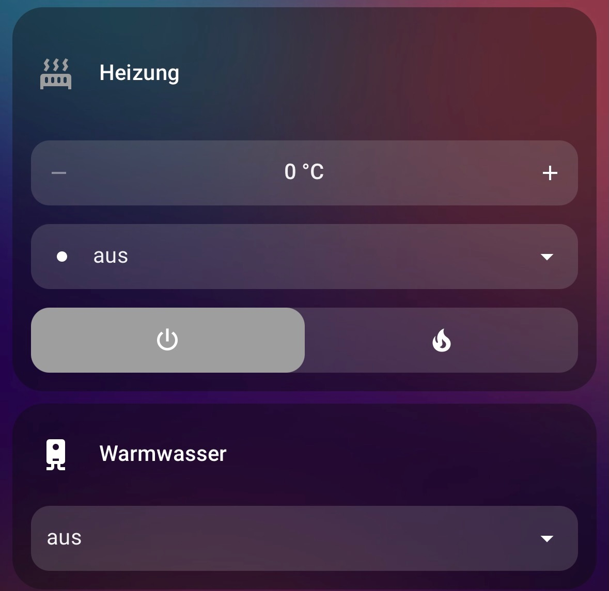
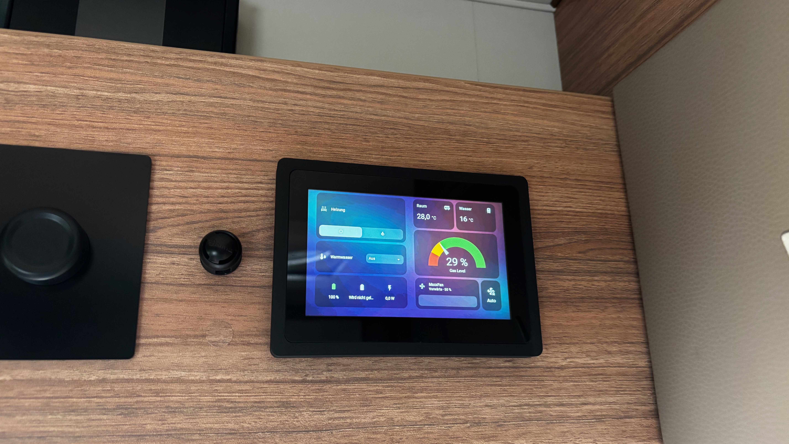
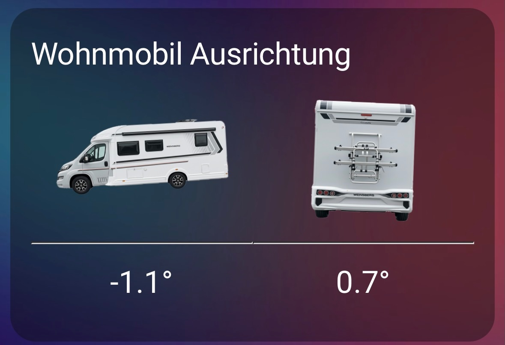

# Smart Home im Wohnmobil 🚐🏠

## Inhaltsverzeichnis
1. [Einleitung & Zielsetzung](#1-einleitung--zielsetzung)
2. [Grundidee & Systemarchitektur](#2-grundidee--systemarchitektur)
3. [Hardware-Übersicht](#3-hardware-übersicht)
4. [Allgemeines Setup](#4-allgemeines-setup)
   - [Home Assistant Basis](#41-home-assistant-basis)
   - [Netzwerk & Remote-Zugriff](#42-netzwerk--remote-zugriff)
   - [GPIO-Pinbelegung](#43-gpio-pinbelegung)
5. [Batterie Management](#5-batterie-management)
6. [Steuerung der Truma Heizung](#6-steuerung-der-truma-heizung)
   - [Verkabelung](#verkabelung)
   - [ASCII-Anschlussplan](#ascii-anschlussplan)
7. [Gaslevel & Außentemperatur](#7-gaslevel--außentemperatur)
   - [Verkabelung ADS1115](#verkabelung-ads1115)
   - [Anschluss Gaslevel Sensor](#anschluss-gaslevel-sensor)
   - [Anschluss Außentemperatur Sensor](#anschluss-außentemperatur-sensor)
8. [Display & Bedienung](#8-display--bedienung)
9. [Interner Buzzer & Relais](#9-interner-buzzer--relais)
   - [Verkabelung und Konfiguration der Relais](#verkabelung-und-konfiguration-der-relais)
10. [Status der Zentralverriegelung](#10-status-der-zentralverriegelung)
11. [Raum- & Kühlschranktemperatur](#11-raum--kühlschranktemperatur)
12. [Frischwasseranzeige](#12-frischwasseranzeige)
13. [MaxxFan Steuerung](#13-maxxfan-steuerung)
14. [Fazit & Ausblick](#14-fazit--ausblick)


---

## 1. Einleitung & Zielsetzung

In diesem Projekt dokumentiere ich den Aufbau eines zentralen Smart-Home-Systems für ein Wohnmobil.
Ziel war es, möglichst viele Funktionen über **ein einziges, robustes System** abzubilden und auf
Cloud-Abhängigkeiten, unnötige Funkverbindungen sowie verteilte Einzellösungen zu verzichten.

Das System basiert auf **Home Assistant** und läuft vollständig lokal auf einem Raspberry Pi.
Alle Komponenten sind so gewählt, dass sie auch im mobilen Einsatz zuverlässig funktionieren.

Der Fokus liegt auf:

* möglichst **wenig Funk- und WLAN-Einzelgeräten**
* **zentraler Steuerung** über einen einzigen Rechner
* direkter **Kabelanbindung von Sensoren und Aktoren**, wo immer es sinnvoll ist
* vollständiger Integration in **Home Assistant**

Das Projekt wurde in einem **Fiat Ducato 8 (BJ 2021)** umgesetzt, ist jedoch grundsätzlich auf andere
Basisfahrzeuge übertragbar.

---

## 2. Grundidee & Systemarchitektur

Home Assistant fungiert als zentrale Steuereinheit für alle Sensoren, Aktoren und Anzeigen.
Wann immer möglich, werden Komponenten **direkt per GPIO, I²C, UART oder Bluetooth** angebunden,
um zusätzliche Mikrocontroller und Funkstrecken zu vermeiden.

Architektur-Überblick:

- Home Assistant als Zentrale
- Direkte Hardware-Anbindung
- Eigenes internes WLAN für Sensorsysteme welche WLAN benötigen
- Keine externe Cloud erforderlich
- Visualisierung über Dashboards
- möglichst wenig ESP32/ESPHome, stattdessen direkte GPIO-, UART-, I²C- und Bluetooth-Anbindungen


---

## 3. Hardware-Übersicht

### Zentrale Steuereinheit

- [Raspberry Pi Compute Module 5 (4 GB RAM, 64 GB eMMC)](https://www.berrybase.de/raspberry-pi-compute-module-5/ram-4gb/wlan-bluetooth-ja/flash-64gb)
- [Raspberry Pi Compute Module 4 IO Board (12V Versorgung möglich)](https://www.berrybase.de/raspberry-pi-compute-module-4-io-board)
- [Metallgehäuse mit Lüfter](https://www.berrybase.de/metall-gehaeuse-fuer-raspberry-pi-compute-module-4-io-board-mit-luefter)
- [WLAN Antennenkit](https://www.berrybase.de/antennenkit-fuer-raspberry-pi-compute-module-4-5)
- [Passiver Kühlkörper](https://www.berrybase.de/raspberry-pi-compute-module-5-passive-cooler)

👉 **Warum diese Kombination?**
Das CM4 IO Board verfügt über einen **direkten 12V-Stromeingang**, was im Wohnmobil ideal ist. Das neuere CM5 IO Board setzt ausschließlich auf USB-C, was einen zusätzlichen Spannungswandler nötig gemacht hätte. Das CM4 IO Board ist vollständig kompatibel mit dem CM5.

---

## 4. Allgemeines Setup

### 4.1 Home Assistant Basis

Als Betriebssystem kommt **Home Assistant OS** zum Einsatz.
Ich habe mich bewusst für ein Compute Module mit eMMC entschieden,
da dieses im Vergleich zu SD-Karten deutlich robuster und langlebiger ist und evtl. Stromausfälle und reboots besser wegsteckt.

Referenzen:
- https://www.home-assistant.io/
- https://www.home-assistant.io/installation/raspberrypi/

---

### 4.2 Netzwerk & Remote-Zugriff

- LAN-Anbindung an den Router im Wohnmobil
- Remote-Zugriff über [Homeway.io](https://homeway.io)

- MQTT Broker: [Mosquitto](https://www.home-assistant.io/integrations/mqtt/) Add-on  

- [Linux Router](  https://github.com/joaofl/hassio-addons/tree/master/linux-router
) Add-on. Dieses Add-on erzeugt ein internes WLAN, in dem ausschließlich Sensoren eingebucht sind.
So bleibt das System unabhängig von externen Routern oder Hotspots.

---

### 4.3 GPIO-Pinbelegung

| GPIO | Pin | Funktion | Komponente |
|----|----|--------|-----------|
| 3.3V | 1 | VDD | Analog Digital Converter - ADS1115 |
| GPIO2 | 3 | I²C SDA | Analog Digital Converter - ADS1115 |
| GPIO3 | 5 | I²C SCL | Analog Digital Converter - ADS1115 |
| GND | 9 | GND | Analog Digital Converter - ADS1115 |
| GND | 6 | UART GND | Truma Heizung |
| GPIO14 | 8 | UART RX | Truma Heizung |
| GPIO15 | 10 | UART TX | Truma Heizung |
| GND | 14 | GND | Gaslevel, Außentemperatur |
| GPIO23 | 16 | Relais 1 | Schalten Relais 1 |
| GPIO24 | 18 | Relais 2 | Schalten Relais 2 |
| GND | 20 | GND | Gaslevel, Außentemperatur|
| GPIO17 | 11 | OUT1 | Optokoppler Zentralverriegelung geschlossen |
| GPIO27 | 13 | OUT2 | Optokoppler Zentralverriegelung geöffnet |
---

## 5. Batterie Management

Als Aufbaubatterie kommt eine **CREABEST LiFePO4 200Ah** Batterie zum Einsatz. Das integrierte BMS wird per Bluetooth ausgelesen.

Integration:
- BLE Battery Management Systems for Home Assistant  
  https://github.com/patman15/BMS_BLE-HA

Die Batterie wird automatisch erkannt und liefert:
- Ladezustand
- Spannung
- Strom
- Temperatur
- Ladezyklen



---

## 6. Steuerung der Truma Heizung

Die Truma Heizung wird direkt per UART/LIN angebunden.
Es sind keine zusätzlichen ESP32 oder Funkmodule notwendig.

- UART zu LIN Adapter https://www.amazon.de/dp/B0895WQ5VM

- Home Assistant Add-on https://github.com/taucher4000/HA_InetBox

### Verkabelung:
* GND → GND
* GPIO14 (TXD) → RX (LIN Adapter)
* GPIO15 (RXD) → TX (LIN Adapter)

### ASCII-Anschlussplan

```
+---------------------------+
|   Raspberry Pi CM5        |
|                           |
|   GPIO14 (TXD) --------+----> RX
|   GPIO15 (RXD) --------+----> TX        +-------------------+
|   GND ----------------------+----------> GND               |
|                                      |  UART / LIN Adapter |
+---------------------------+           +----------+----------+
                                                     |
                                                     | LIN Bus
                                                     v
                                            +------------------+
                                            |  Truma Heizung   |
                                            |  (RJ11 / RJ12)   |
                                            +------------------+
```

Für eine saubere Verbindung ist eine RJ12-Buchse im Gehäuse verbaut:
https://www.berrybase.de/bel-fuse-rj12-buchsensteckverbinder-zuverlaessige-900-winkelverbindung-mit-6-polen-und-tht-montage




---

## 7. Gaslevel & Außentemperatur

In diesem Abschnitt beschreibe ich die Erfassung des **Gasfüllstands** sowie der **Außentemperatur** über kabelgebundene Sensoren. Ziel war es, auf Funklösungen zu verzichten und beide Messwerte direkt über den Raspberry Pi in Home Assistant zu integrieren.

Zum auslesen der Sensoren habe ich mich für einen Analog Ditigal Converter (ADC) ADS1115 16-Bit Analog-Digital-Wandler entschieden
 (https://www.amazon.de/dp/B07PXFD3BH).

Die Steuerung im Home Assistant erfolgt über die [ha-ads1115-component](https://github.com/Elwinmage/ha-ads1115-component) Integration.

 #### Verkabelung ADS1115:

* Pin 1 (3.3V) → VDD
* Pin 3 (GPIO02 / SDA) → SDA
* Pin 5 (GPIO03 / SCL) → SCL
* Pin 9 (GND) → GND


### Anschluss Gaslevel Sensor: 
Ich nutze eine Alugas TravelMate Flasche mit Rotarex-Gassensor, der je nach Füllstand einen Widerstand zwischen 0 und 90 Ohm liefert:  https://shop.frontgas.de/produkt/spezial-sender-fuer-alugas-travelmate-tankflaschen-rotarex/

  * Anschluss an **A1** des ADS1115
  * Referenzwiderstand: **100 Ohm**
  * Messung gegen Masse

Für den Sensor habe ich einen Helper vom Typ `Sensor` als Template erstellt. Nachfolgend das Template zum umwandeln der ADC Spannung in einen Prozent-Wert:

```




   {# Widerstand, der als "leer" gilt #}

{# Ungültige ADC-Spannung abfangen #}

  unavailable

  {# Sensorwiderstand aus Spannungsteiler berechnen #}
  

  {# Totzone für leere Flasche #}
  
    0
  
    

    
      0
    
      100
    
      {{ fill_level_percent | round(0) }}
    
  

```
**Optional:** Um große Schwankungen des Gaslevel Sensors z.B. währen der Fahrt zu vermeiden, habe ich zusätzlich noch einen Statistik Sensor als Helper angelegt, welcher den Percentil 50 Mittelwert  der letzten 5 Minuten nutzt. Somit erhöht uns senkt  der Sensor nur langsam den Wert.


### Anschluss Außentemperatur Sensor:

Als Außentemperatursensor kommt ein **KTY81-210** zum Einsatz: [https://www.amazon.de/dp/B088V6K54S](https://www.amazon.de/dp/B088V6K54S)

  * Anschluss an **A0** des ADS1115
  * Referenzwiderstand: **15 KOhm**
  * Messung gegen Masse

Für den Sensor habe ich einen Helper vom Typ `Sensor` als Template erstellt. Nachfolgend das Template zum umwandeln der ADC Spannung in einen Temperatur-Wert. Dabei wird die Umrechnung basierend auf den Steinhart-Hart Koeffizienten benutzt:


```



  {# <-- Hier kann ein Offset einstellen (z. B. +1.5 oder -2.3) #}

{# safeguard: gültige Spannung (>0 und <Vcc) #}

  unavailable

  {# Widerstand (Variante: Rref oben, Sensor nach GND) #}
  

  {# Steinhart-Hart Koeffizienten (aus NXP-Typwerten 0/25/50°C) #}
  
  
  

  
  

  
    unavailable
  
    
    

    
      unavailable
    
      {{ temperature_celsius | round(1) }}
    
  

```

---

## 8. Display & Bedienung

Als zentrales Bedien- und Anzeigedisplay nutze ich ein [Waveshare 5" HDMI AMOLED](https://www.welectron.com/Waveshare-19299-5inch-HDMI-AMOLED) Display welches via HDMI für Bild und USB für Touch-Eingabe angeschlossen ist.

- HAOS Kiosk Add-on: https://github.com/puterboy/HAOS-kiosk

Das Display zeigt das normale Home-Assistant-Dashboard und schaltet sich nach Inaktivität automatisch ab.



---

## 9. Interner Buzzer & Relais

Für akustische Rückmeldungen (z. B. Alarmanlage, Bestätigungstöne) nutze ich:

- Aktiver Buzzer  https://www.amazon.de/dp/B09RFH1T8J
- 2-Kanal Relaismodul https://de.aliexpress.com/item/32888878613.html


### Verkabelung und Konfiguration der Relais

* GPIO23 → Relais Kanal 1
* GPIO24 → Relais Kanal 2
* 5V → Pin 4
* GND → Pin 20

Zur Steuerung der Relais via GPIO nutze ist die [rpi_gpio](https://github.com/home-assistant/core/tree/dev/homeassistant/components/rpi_gpio) Integation, welche via HACS installiert wird. Nach der Installation kann man die Reilas in der `configurtion.yaml` wie folgt konfigurieren:

```
switch:
  - platform: rpi_gpio
    switches:
      - port: 23
        name: "Alarm Sirene"
        invert_logic: true
      - port: 24
        name: "interner Buzzer"
        invert_logic: true
```

---

## 10. Status der Zentralverriegelung

Der Fiat Ducato stellt an der **B-Säule Beifahrerseite** einen Stecker mit zwei Leitungen zur Verfügung:

* Leitung A: 12V oder Masse
* Leitung B: 12V oder Masse

Je nach Zustand (auf/zu).

Zur galvanischen Trennung nutze ich einen [2-Kanal-Optokoppler](https://www.amazon.de/dp/B0CJY5PL4C) welcher wie folgt angeschlossen wird:

**Leitungen vom Fahrzeug zum Hailege 2-Kanal Modul:**
```
Kabel1 -----------------+
                        +----> IN1 (Kanal1, LOCK)
                        +----> GND2 (Kanal2, UNLOCK)

Kabel2 -----------------+
                        +----> GND1 (Kanal1, LOCK)
                        +----> IN2 (Kanal2, UNLOCK)
```

**Hailege 2-Kanal Modul zum Raspberry Pi:**
```
OUT1 ------------------> GPIO17 (LOCK)
OUT2 ------------------> GPIO27 (UNLOCK)
GND -------------------> Pi GND (Spannungswandler)
```

Zur Auslesung Optokoppler via GPIO nutze ist die [rpi_gpio](https://github.com/home-assistant/core/tree/dev/homeassistant/components/rpi_gpio) Integation, welche via HACS installiert wird. Nach der Installation kann man die Optokoppler in der `configurtion.yaml` wie folgt konfigurieren:

```
binary_sensor:
  - platform: rpi_gpio
    sensors:
      - port: 17
        name: womo_zv_geschlossen
        pull_mode: "UP"
        invert_logic: true
      - port: 27
        name: womo_zv_geöffnet
        pull_mode: "UP"
        invert_logic: true
```

---

## 11. Raum- & Kühlschranktemperatur

Hier setze ich bewusst auf einfache, günstige Sensoren:

**Xiaomi Bluetooth Thermometer**
[https://amzn.eu/d/jadlMh7](https://amzn.eu/d/jadlMh7)

Diese kommunizieren über **Bluetooth (BTHome-Protokoll)** und lassen sich direkt in Home Assistant integrieren.

**Hinweis:** Je nach Modell ist ggf. ein **Firmware-Flash** notwendig, um BTHome zu aktivieren


---

## 12. Frischwasseranzeige

Für den Frischwasserstand verwende ich den [BlueLevel+ Sensor](https://www.blue-battery.com/product-page/bluelevel). Dieser beitet neben dem Wasserlevel auch einen Gyro-Sensor mit dem man die Ausrichtung des Wohnmobils messen und visualisieren kann.

Eigenschaften:

* WLAN-Anbindung über internes Sensor WLAN (siehe oben)
* MQTT-Datenübertragung (alle 5 Sekunden)
* integrierter Gyrosensor zur Erkennung der Fahrzeugneigung

Der Sensor ersetzt die originalen Messsonden.

Der Sensor sendet Wasserstand und Fahrzeugneigung per MQTT.
Ein ESP32 emuliert zusätzlich das originale Schaudt LT 316 Display damit die originale Anzeige im Wohnmobil weiterhin funktionsfähig bleibt: https://github.com/taucher4000/schaudt-lt316-bluelevel-emulator



---
## 13. MaxxFan Steuerung

🚧 Inhalt folgt

---
## 14. Fazit & Ausblick

Ich entwickle das System ständig weiter und werde diese Dokumentation von Zeit zu Zeit aktualisieren. Für Anregungen oder Verbesserungsvorschläge bin ich jederzeit offen.

Happy Smart Camping 🚐✨

---
## Haftungsausschluss / Disclaimer ⚠️

**Wichtiger Hinweis:**  

Dieses Projekt dient ausschließlich **zu Informations- und Demonstrationszwecken**.  
Alle Anleitungen, Verkabelungen, Softwarekonfigurationen und Hardwareempfehlungen erfolgen **ohne Gewähr**.

Ich übernehme **keine Haftung** für:

- Schäden an Fahrzeugen, Elektronik oder anderen Komponenten
- Verletzungen oder Unfälle
- Fehlfunktionen oder Datenverlust
- Folgen, die durch unsachgemäße Umsetzung oder Abweichungen vom beschriebenen Setup entstehen

Die Umsetzung erfolgt **auf eigene Verantwortung**. Bitte prüfe alle Anschlüsse, Spannungen und Sicherheitsaspekte sorgfältig.  
Besonders im Bereich Fahrzeug-Elektronik können Fehler **lebensgefährlich** sein oder teure Schäden verursachen.  
