# Smart Home im Wohnmobil 🚐🏠

## Inhaltsverzeichnis
1. [Einleitung & Zielsetzung](#1-einleitung--zielsetzung)
2. [Grundidee & Systemarchitektur](#2-grundidee--systemarchitektur)
3. [Hardware-Übersicht](#3-hardware-übersicht)
4. [Allgemeines Setup](#4-allgemeines-setup)
   - [Home Assistant Basis](#41-home-assistant-basis)
   - [Netzwerk & Remote-Zugriff](#42-netzwerk--remote-zugriff)
   - [GPIO-Pinbelegung](#43-gpio-pinbelegung)
5. [Batterie Management](#5-batterie-management)
6. [Steuerung der Truma Heizung](#6-steuerung-der-truma-heizung)
   - [Verkabelung](#verkabelung)
   - [ASCII-Anschlussplan](#ascii-anschlussplan)
7. [Gaslevel & Außentemperatur](#7-gaslevel--außentemperatur)
   - [Verkabelung ADS1115](#verkabelung-ads1115)
   - [Anschluss Gaslevel Sensor](#anschluss-gaslevel-sensor)
   - [Anschluss Außentemperatur Sensor](#anschluss-außentemperatur-sensor)
8. [Display & Bedienung](#8-display--bedienung)
9. [Interner Buzzer & Relais](#9-interner-buzzer--relais)
   - [Verkabelung und Konfiguration der Relais](#verkabelung-und-konfiguration-der-relais)
10. [Status der Zentralverriegelung](#10-status-der-zentralverriegelung)
11. [Raum- & Kühlschranktemperatur](#11-raum--kühlschranktemperatur)
12. [Frischwasseranzeige](#12-frischwasseranzeige)
13. [MaxxFan Steuerung](#13-maxxfan-steuerung)
14. [Solaranzeige](#14-solaranzeige)
15. [Fazit & Ausblick](#15-fazit--ausblick)


---

## 1. Einleitung & Zielsetzung

In diesem Projekt dokumentiere ich den Aufbau eines zentralen Smart-Home-Systems für ein Wohnmobil.
Ziel war es, möglichst viele Funktionen über **ein einziges, robustes System** abzubilden und auf
Cloud-Abhängigkeiten, unnötige Funkverbindungen sowie verteilte Einzellösungen zu verzichten.

Das System basiert auf **Home Assistant** und läuft vollständig lokal auf einem Raspberry Pi.
Alle Komponenten sind so gewählt, dass sie auch im mobilen Einsatz zuverlässig funktionieren.

Der Fokus liegt auf:

* möglichst **wenig Funk- und WLAN-Einzelgeräten**
* **zentraler Steuerung** über einen einzigen Rechner
* direkter **Kabelanbindung von Sensoren und Aktoren**, wo immer es sinnvoll ist
* vollständiger Integration in **Home Assistant**

Das Projekt wurde in einem **Fiat Ducato 8 (BJ 2021)** umgesetzt, ist jedoch grundsätzlich auf andere
Basisfahrzeuge übertragbar.

---

## 2. Grundidee & Systemarchitektur

Home Assistant fungiert als zentrale Steuereinheit für alle Sensoren, Aktoren und Anzeigen.
Wann immer möglich, werden Komponenten **direkt per GPIO, I²C, UART oder Bluetooth** angebunden,
um zusätzliche Mikrocontroller und Funkstrecken zu vermeiden.

Architektur-Überblick:

- Home Assistant als Zentrale
- Direkte Hardware-Anbindung
- Eigenes internes WLAN für Sensorsysteme welche WLAN benötigen
- Keine externe Cloud erforderlich
- Visualisierung über Dashboards
- möglichst wenig ESP32/ESPHome, stattdessen direkte GPIO-, UART-, I²C- und Bluetooth-Anbindungen


| | |
|-|-|
|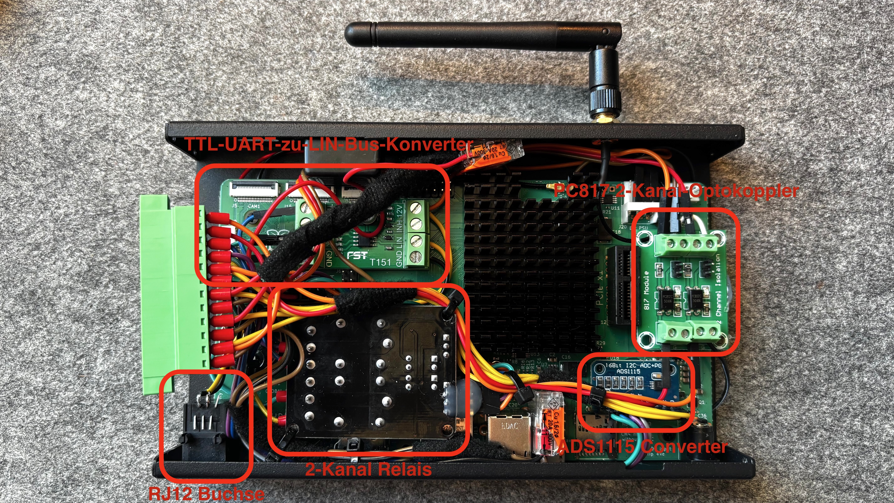||
|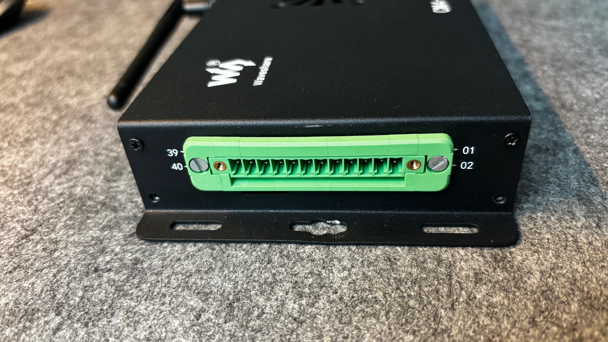||


---

## 3. Hardware-Übersicht

### Zentrale Steuereinheit

- [Raspberry Pi Compute Module 5 (4 GB RAM, 64 GB eMMC)](https://www.berrybase.de/raspberry-pi-compute-module-5/ram-4gb/wlan-bluetooth-ja/flash-64gb)
- [Raspberry Pi Compute Module 4 IO Board (12V Versorgung möglich)](https://www.berrybase.de/raspberry-pi-compute-module-4-io-board)
- [Metallgehäuse mit Lüfter](https://www.berrybase.de/metall-gehaeuse-fuer-raspberry-pi-compute-module-4-io-board-mit-luefter)
- [WLAN Antennenkit](https://www.berrybase.de/antennenkit-fuer-raspberry-pi-compute-module-4-5)
- [Passiver Kühlkörper](https://www.berrybase.de/raspberry-pi-compute-module-5-passive-cooler)

👉 **Warum diese Kombination?**
Das CM4 IO Board verfügt über einen **direkten 12V-Stromeingang**, was im Wohnmobil ideal ist. Das neuere CM5 IO Board setzt ausschließlich auf USB-C, was einen zusätzlichen Spannungswandler nötig gemacht hätte. Das CM4 IO Board ist vollständig kompatibel mit dem CM5.

---

## 4. Allgemeines Setup

### 4.1 Home Assistant Basis

Als Betriebssystem kommt **Home Assistant OS** zum Einsatz.
Ich habe mich bewusst für ein Compute Module mit eMMC entschieden,
da dieses im Vergleich zu SD-Karten deutlich robuster und langlebiger ist und evtl. Stromausfälle und reboots besser wegsteckt.

Referenzen:
- https://www.home-assistant.io/
- https://www.home-assistant.io/installation/raspberrypi/

---

### 4.2 Netzwerk & Remote-Zugriff

- LAN-Anbindung an den Router im Wohnmobil
- Remote-Zugriff über [Homeway.io](https://homeway.io)

- MQTT Broker: [Mosquitto](https://www.home-assistant.io/integrations/mqtt/) Add-on  

- [Linux Router](  https://github.com/joaofl/hassio-addons/tree/master/linux-router
) Add-on. Dieses Add-on erzeugt ein internes WLAN, in dem ausschließlich Sensoren eingebucht sind.
So bleibt das System unabhängig von externen Routern oder Hotspots.

---

### 4.3 GPIO-Pinbelegung

| GPIO | Pin | Funktion | Komponente |
|----|----|--------|-----------|
| 3.3V | 1 | VDD | Analog Digital Converter - ADS1115 |
| GPIO2 | 3 | I²C SDA | Analog Digital Converter - ADS1115 |
| GPIO3 | 5 | I²C SCL | Analog Digital Converter - ADS1115 |
| GND | 9 | GND | Analog Digital Converter - ADS1115 |
| GND | 6 | UART GND | Truma Heizung |
| GPIO14 | 8 | UART RX | Truma Heizung |
| GPIO15 | 10 | UART TX | Truma Heizung |
| GND | 14 | GND | Gaslevel, Außentemperatur |
| GPIO23 | 16 | Relais 1 | Schalten Relais 1 |
| GPIO24 | 18 | Relais 2 | Schalten Relais 2 |
| GND | 20 | GND | Gaslevel, Außentemperatur|
| GPIO17 | 11 | OUT1 | Optokoppler Zentralverriegelung geschlossen |
| GPIO27 | 13 | OUT2 | Optokoppler Zentralverriegelung geöffnet |
---

## 5. Batterie Management

Als Aufbaubatterie kommt eine **CREABEST LiFePO4 200Ah** Batterie zum Einsatz. Das integrierte BMS wird per Bluetooth ausgelesen.

Integration:
- BLE Battery Management Systems for Home Assistant  
  https://github.com/patman15/BMS_BLE-HA

Die Batterie wird automatisch erkannt und liefert:
- Ladezustand
- Spannung
- Strom
- Temperatur
- Ladezyklen

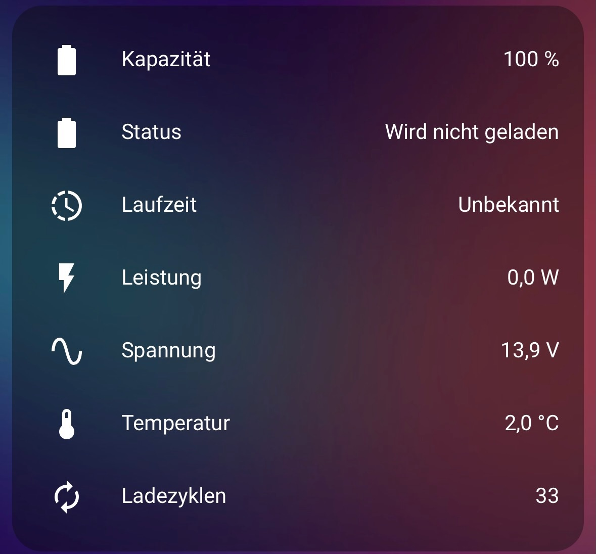

---

## 6. Steuerung der Truma Heizung

Die Truma Heizung wird direkt per UART/LIN angebunden.
Es sind keine zusätzlichen ESP32 oder Funkmodule notwendig.

- UART zu LIN Adapter https://www.amazon.de/dp/B0895WQ5VM

- Home Assistant Add-on https://github.com/taucher4000/HA_InetBox

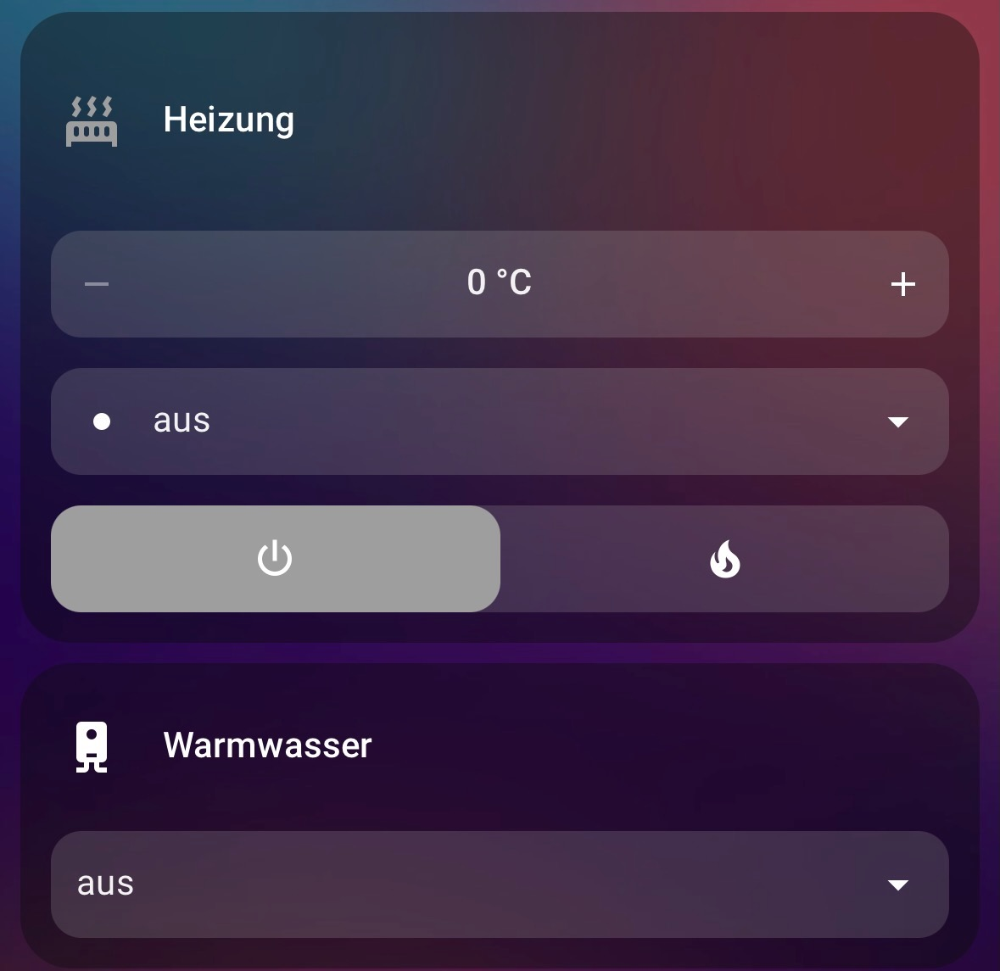

### Verkabelung:
* GND → GND
* GPIO14 (TXD) → RX (LIN Adapter)
* GPIO15 (RXD) → TX (LIN Adapter)

### ASCII-Anschlussplan

```
+---------------------------+
|   Raspberry Pi CM5        |
|                           |
|   GPIO14 (TXD) --------+----> RX
|   GPIO15 (RXD) --------+----> TX        +-------------------+
|   GND ----------------------+----------> GND               |
|                                      |  UART / LIN Adapter |
+---------------------------+           +----------+----------+
                                                     |
                                                     | LIN Bus
                                                     v
                                            +------------------+
                                            |  Truma Heizung   |
                                            |  (RJ11 / RJ12)   |
                                            +------------------+
```

Für eine saubere Verbindung ist eine RJ12-Buchse im Gehäuse verbaut:
https://www.berrybase.de/bel-fuse-rj12-buchsensteckverbinder-zuverlaessige-900-winkelverbindung-mit-6-polen-und-tht-montage

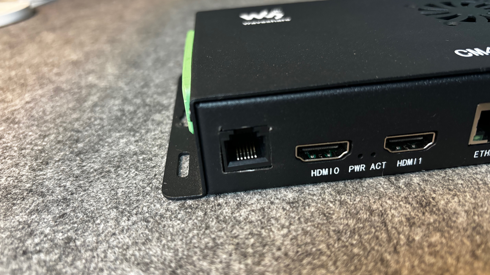

---

## 7. Gaslevel & Außentemperatur

In diesem Abschnitt beschreibe ich die Erfassung des **Gasfüllstands** sowie der **Außentemperatur** über kabelgebundene Sensoren. Ziel war es, auf Funklösungen zu verzichten und beide Messwerte direkt über den Raspberry Pi in Home Assistant zu integrieren.

Zum auslesen der Sensoren habe ich mich für einen Analog Ditigal Converter (ADC) ADS1115 16-Bit Analog-Digital-Wandler entschieden
 (https://www.amazon.de/dp/B07PXFD3BH).

Die Steuerung im Home Assistant erfolgt über die [ha-ads1115-component](https://github.com/Elwinmage/ha-ads1115-component) Integration.

 #### Verkabelung ADS1115:

* Pin 1 (3.3V) → VDD
* Pin 3 (GPIO02 / SDA) → SDA
* Pin 5 (GPIO03 / SCL) → SCL
* Pin 9 (GND) → GND


### Anschluss Gaslevel Sensor: 
Ich nutze eine Alugas TravelMate Flasche mit Rotarex-Gassensor, der je nach Füllstand einen Widerstand zwischen 0 und 90 Ohm liefert:  https://shop.frontgas.de/produkt/spezial-sender-fuer-alugas-travelmate-tankflaschen-rotarex/

  * Anschluss an **A1** des ADS1115
  * Referenzwiderstand: **100 Ohm**
  * Messung gegen Masse

Für den Sensor habe ich einen Helper vom Typ `Sensor` als Template erstellt. Nachfolgend das Template zum umwandeln der ADC Spannung in einen Prozent-Wert:

```



 {# Widerstand ab wann die Flasche als leer gilt #}
 {# Maximal Widerstand der als 100% gilt #}



{# Ungültige ADC-Spannung abfangen #}

  unavailable

  {# Sensorwiderstand aus Spannungsteiler berechnen #}
  

  
    0
  
    100
  
    
    {{ fill_level_percent | round(0) }}
  

```
**Optional:** Um große Schwankungen des Gaslevel Sensors z.B. währen der Fahrt zu vermeiden, habe ich zusätzlich noch einen Statistik Sensor als Helper angelegt, welcher den Percentil 50 Mittelwert  der letzten 5 Minuten nutzt. Somit erhöht uns senkt  der Sensor nur langsam den Wert.


### Anschluss Außentemperatur Sensor:

Als Außentemperatursensor kommt ein **KTY81-210** zum Einsatz: [https://www.amazon.de/dp/B088V6K54S](https://www.amazon.de/dp/B088V6K54S)

  * Anschluss an **A0** des ADS1115
  * Referenzwiderstand: **15 KOhm**
  * Messung gegen Masse

Für den Sensor habe ich einen Helper vom Typ `Sensor` als Template erstellt. Nachfolgend das Template zum umwandeln der ADC Spannung in einen Temperatur-Wert:


```






  unavailable

  {# Berechnung des Sensor-Widerstands (R2 im Spannungsteiler) #}
  

  {# Stützpunkte aus dem Datenblatt (Temperatur °C, Widerstand Ohm) #}
  

  
  
  {# Suche der passenden Tabellenzeile und lineare Interpolation #}
  
    
    
    
    
      
      
    
  

  {# Ergebnisausgabe mit Offset und Rundung auf 1 Nachkommastelle #}
  
    {{ (berechnung.temperatur + temperatur_offset) | round(1) }}
  
    {# Fallback für Werte leicht außerhalb der Tabelle #}
    
      {{ (datenblatt_tabelle[0][0] + temperatur_offset) | round(1) }}
    
      {{ (datenblatt_tabelle[-1][0] + temperatur_offset) | round(1) }}
    
      unavailable
    
  

```

---

## 8. Display & Bedienung

Als zentrales Bedien- und Anzeigedisplay nutze ich ein [Waveshare 5" HDMI AMOLED](https://www.welectron.com/Waveshare-19299-5inch-HDMI-AMOLED) Display welches via HDMI für Bild und USB für Touch-Eingabe angeschlossen ist. Als Rahmen für das Display habe ich mir einen eigenen Rahmen mit dem 3D-Drucker gedruckt. Dieser Rahmen passt perfekt in die vorhandene Öffnung des originalen Truma inetX Pannels. Die Datei zum drucken ist [hier](files/display-rahmen.f3d) zu finden.


- HAOS Kiosk Add-on: https://github.com/puterboy/HAOS-kiosk

Das Display zeigt das normale Home-Assistant-Dashboard und schaltet sich nach Inaktivität automatisch ab.

### Konfiguration des Displays

Damit das Display Orgnungsgemäß mit Home Assistent und dem Raspberry Pi funktioniert, musste ich noch folgende Konfigurationen in der `config.txt` und der `cmdline.txt` durchführen:

config.txt:
```
dtoverlay=vc4-kms-v3d
hdmi_force_hotplug=1 
config_hdmi_boost=10
max_usb_current=1
disable_overscan=1
hdmi_group=2
hdmi_mode=87
hdmi_timings=960 0 190 4 32 544 0 10 10 12 0 0 0 60 0 41000000 3
hdmi_blanking=0
```

cmdline.txt: 
```
video=HDMI-A-1:960x544M@60D
```

### Bildschirm Timeout und aufwecken des Displays

Das Waveshare 5" HDMI AMOLED Display hat leider das Problem, dass es bei Nutzung des regulären Hardware-Timeouts (DPMS) ca. 1–2 Sekunden benötigt, um aus dem Standby aufzuwachen. Diese Verzögerung hat mich gestört. Daher habe ich eine softwareseitige Lösung implementiert:

- **Hardware-Timeout deaktivieren:** Ich habe im HAOS Kiosk Add-on den SCREEN_TIMEOUT auf 0 gestellt. Dies verhindert, dass das Display das HDMI-Signal verliert und in den hardwareseitigen Schlafmodus wechselt.
- **Software-Blackout via JavaScript:** Stattdessen habe ich ein JavaScript (`/www/luakit-waveshare-fix.js`) als Custom Resource unter Einstellungen -> Dashboards -> Ressourcen hinzugefügt. Dieses Skript legt nach einer definierten Inaktivitätszeit ein komplett schwarzes Overlay über die Benutzeroberfläche.

Da bei einem AMOLED-Panel jeder Pixel einzeln leuchtet, ist ein tiefschwarzes Bild energetisch nahezu mit dem Ausschalten gleichzusetzen (die Pixel sind physisch aus). **Ergebnis:** Durch den dauerhaft aktiven HDMI-Sync wacht das Display bei Berührung ohne Verzögerung (Instant-Wakeup) auf. Gleichzeitig verhindert das Skript durch einen kurzen „Debounce“-Zeitraum, dass die erste Berührung beim Aufwachen bereits eine ungewollte Aktion im Dashboard auslöst.  

/www/luakit-waveshare-fix.js:
```
(function() {
    // --- KONFIGURATION ---
    const IDLE_TIME = 240000;      // Zeit bis zum "Ausschalten" (4 Minuten)
    const DEBOUNCE_WAIT = 500;     // Kurze Sperre nach dem Aufwachen (0.5 Sek)
    // ---------------------

    // Sicherheitschecks (Browser)
    if (!navigator.userAgent.toLowerCase().includes('x11')) return;

    let lastInteraction = Date.now();
    let isSleeping = false;

    // Overlay-Element erstellen (Der schwarze Vorhang)
    const overlay = document.createElement('div');
    overlay.style.cssText = `
        position: fixed;
        top: 0;
        left: 0;
        width: 100%;
        height: 100%;
        background: black;
        z-index: 999999;
        display: none;
        cursor: none;
    `;
    document.body.appendChild(overlay);

    function sleep() {
        overlay.style.display = 'block';
        isSleeping = true;
        console.log("AMOLED-Schlafmodus aktiviert (HDMI aktiv)");
    }

    function wakeUp(e) {
        if (isSleeping) {
            // Verhindert den Klick auf das Dashboard unter dem Overlay
            if (e) {
                e.preventDefault();
                e.stopPropagation();
                e.stopImmediatePropagation();
            }
            
            overlay.style.display = 'none';
            
            // Kurze Debounce-Phase einleiten
            setTimeout(() => {
                isSleeping = false;
                console.log("System bereit.");
            }, DEBOUNCE_WAIT);
            
            lastInteraction = Date.now();
            return false;
        }
        lastInteraction = Date.now();
    }

    // Timer zur Überprüfung der Inaktivität
    setInterval(() => {
        if (!isSleeping && (Date.now() - lastInteraction > IDLE_TIME)) {
            sleep();
        }
    }, 5000);

    // Event-Listener zum Aufwachen
    overlay.addEventListener('touchstart', wakeUp, { capture: true, passive: false });
    overlay.addEventListener('mousedown', wakeUp, { capture: true, passive: false });
    
    // Interaktion loggen, wenn das Display wach ist
    document.addEventListener('touchstart', () => { lastInteraction = Date.now(); }, true);
    document.addEventListener('mousedown', () => { lastInteraction = Date.now(); }, true);

    console.log("Instant-Wakeup Script für AMOLED geladen.");
})();

```

| | |
|-|-|
|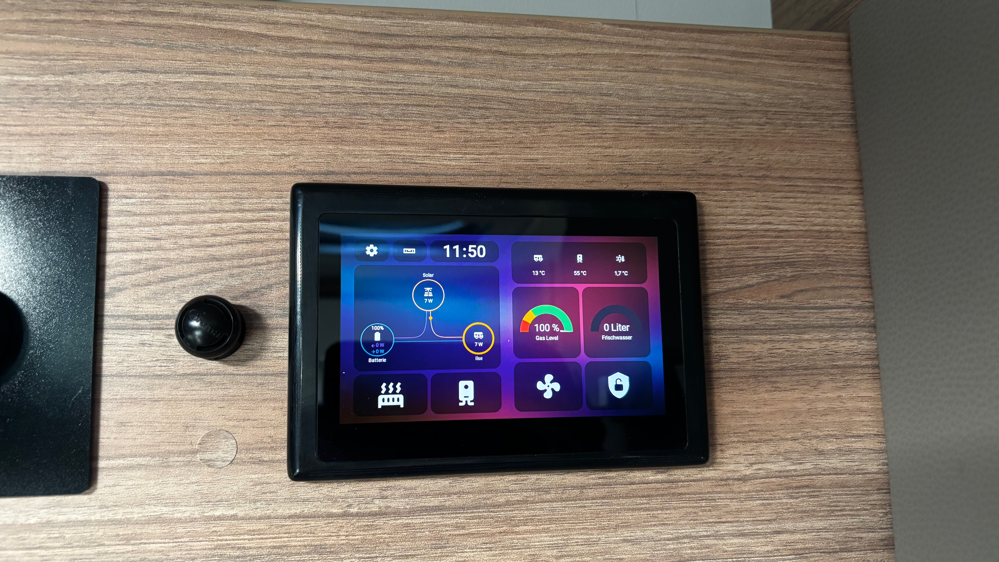|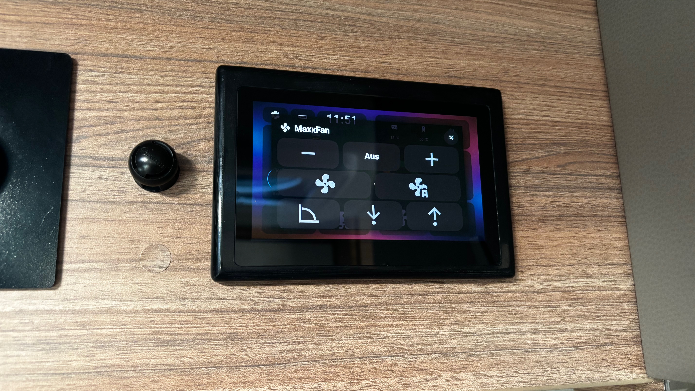|
|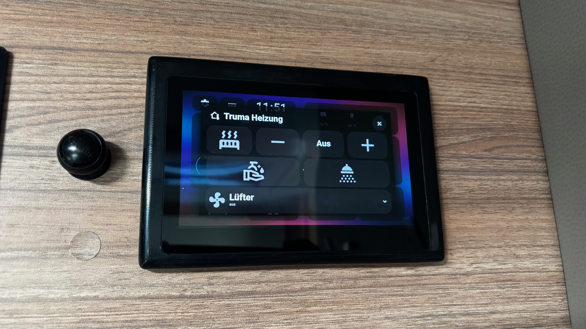|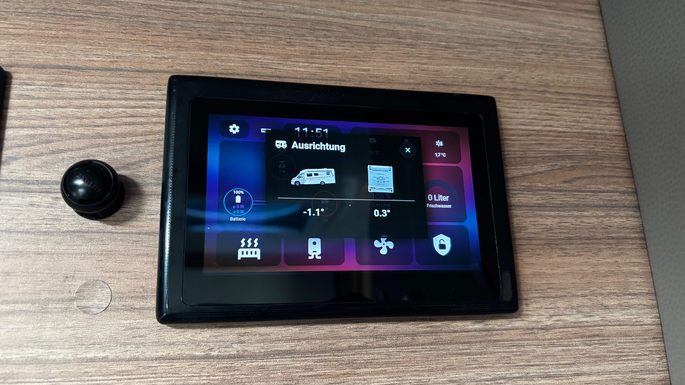|


---

## 9. Interner Buzzer & Relais

Für akustische Rückmeldungen (z. B. Alarmanlage, Bestätigungstöne) nutze ich:

- Aktiver Buzzer  https://www.amazon.de/dp/B09RFH1T8J
- 2-Kanal Relaismodul https://de.aliexpress.com/item/32888878613.html


### Verkabelung und Konfiguration der Relais

* GPIO23 → Relais Kanal 1
* GPIO24 → Relais Kanal 2
* 5V → Pin 4
* GND → Pin 20

Zur Steuerung der Relais via GPIO nutze ist die [rpi_gpio](https://github.com/home-assistant/core/tree/dev/homeassistant/components/rpi_gpio) Integation, welche via HACS installiert wird. Nach der Installation kann man die Reilas in der `configurtion.yaml` wie folgt konfigurieren:

```
switch:
  - platform: rpi_gpio
    switches:
      - port: 23
        name: "Alarm Sirene"
        invert_logic: true
      - port: 24
        name: "interner Buzzer"
        invert_logic: true
```

---

## 10. Status der Zentralverriegelung

Der Fiat Ducato stellt an der **B-Säule Beifahrerseite** einen Stecker mit zwei Leitungen zur Verfügung:

* Leitung A: 12V oder Masse
* Leitung B: 12V oder Masse

Je nach Zustand (auf/zu).

Zur galvanischen Trennung nutze ich einen [2-Kanal-Optokoppler](https://www.amazon.de/dp/B0CJY5PL4C) welcher wie folgt angeschlossen wird:

**Leitungen vom Fahrzeug zum Hailege 2-Kanal Modul:**
```
Kabel 1 LOCK ------------------> IN1
Fahrzeug Masse ----------------> GND1
Kabel 2 UNLOCK ----------------> IN2
Fahrzeug Masse ----------------> GND2
```

**Hailege 2-Kanal Modul zum Raspberry Pi:**
```
OUT1 ------------------> GPIO17 (LOCK)
OUT2 ------------------> GPIO27 (UNLOCK)
GND -------------------> Pi GND (Spannungswandler)
```

Zur Auslesung Optokoppler via GPIO nutze ist die [rpi_gpio](https://github.com/home-assistant/core/tree/dev/homeassistant/components/rpi_gpio) Integation, welche via HACS installiert wird. Nach der Installation kann man die Optokoppler in der `configurtion.yaml` wie folgt konfigurieren:

```
binary_sensor:
  - platform: rpi_gpio
    sensors:
      - port: 17
        name: womo_zv_geschlossen
        pull_mode: "UP"
        invert_logic: true
      - port: 27
        name: womo_zv_geöffnet
        pull_mode: "UP"
        invert_logic: true
```

---

## 11. Raum- & Kühlschranktemperatur

Hier setze ich bewusst auf einfache, günstige Sensoren:

**Xiaomi Bluetooth Thermometer**
[https://amzn.eu/d/jadlMh7](https://amzn.eu/d/jadlMh7)

Diese kommunizieren über **Bluetooth (BTHome-Protokoll)** und lassen sich direkt in Home Assistant integrieren.

**Hinweis:** Je nach Modell ist ggf. ein **Firmware-Flash** notwendig, um BTHome zu aktivieren


---

## 12. Frischwasseranzeige

Für den Frischwasserstand verwende ich den [BlueLevel+ Sensor](https://www.blue-battery.com/product-page/bluelevel). Dieser beitet neben dem Wasserlevel auch einen Gyro-Sensor mit dem man die Ausrichtung des Wohnmobils messen und visualisieren kann.

Eigenschaften:

* WLAN-Anbindung über internes Sensor WLAN (siehe oben)
* MQTT-Datenübertragung (alle 5 Sekunden)
* integrierter Gyrosensor zur Erkennung der Fahrzeugneigung

Der Sensor ersetzt die originalen Messsonden.

Der Sensor sendet Wasserstand und Fahrzeugneigung per MQTT.
Ein ESP32 emuliert zusätzlich das originale Schaudt LT 316 Display damit die originale Anzeige im Wohnmobil weiterhin funktionsfähig bleibt: https://github.com/taucher4000/schaudt-lt316-bluelevel-emulator

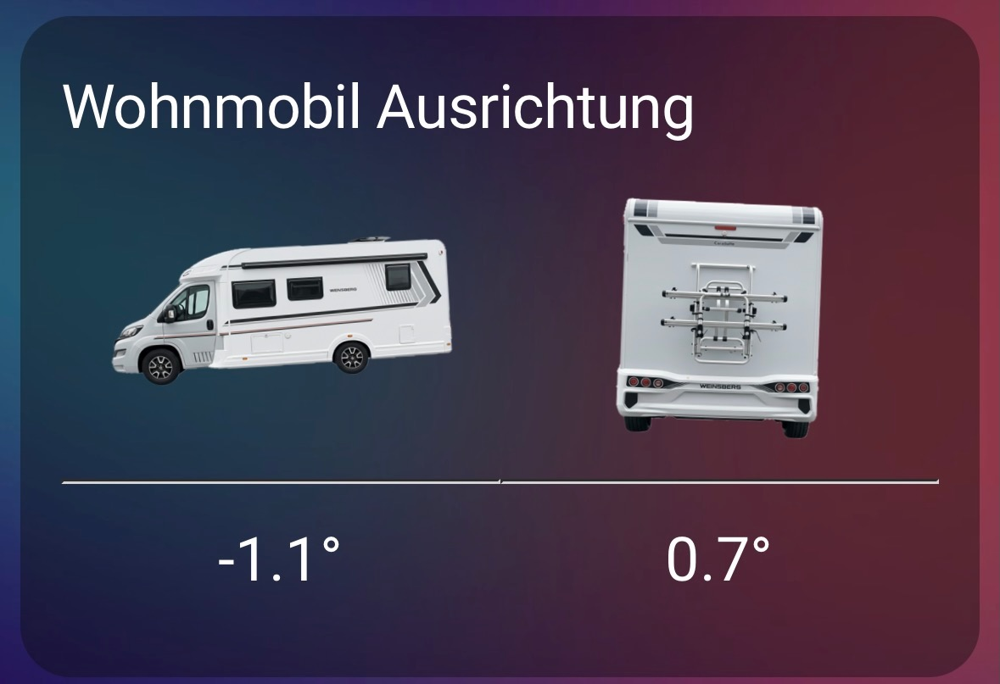

---
## 13. MaxxFan Steuerung

Als lüftung habe ich einen MaxxFan Lüfter verbaut. Dieser wird via Infrarot und einem ESP32 mit ESPHome gesteuert. Dafür habe ich das [SmartyVan/MaxxAir-Fan-ESPHome](https://github.com/SmartyVan/MaxxAir-Fan-ESPHome) Projekt genutzt. Die gesamte Steuerung habe ich hinter der MaxFan Verkleidung versteckt und den ESP32 mittels einem [DC-DC Step Down Converter](https://amzn.eu/d/9aFi5Lt) mit Strom versorg.

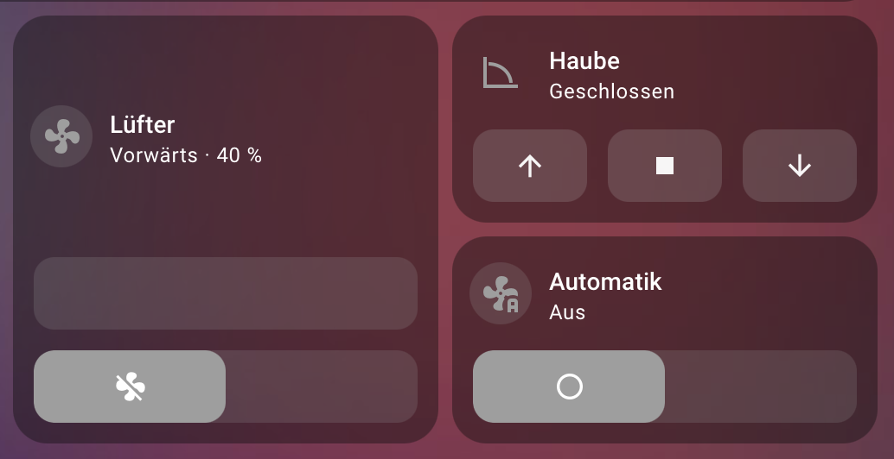


---
## 14. Solaranzeige

Als Solar Regler nutze ich einen `VOTRONIC SOLAR LADEREGLER SR 220`. Dieser hat einen RJ11 Anschluss um ein Display anzuschließen. Dieser Anschluss wird genutzt um mit dem ESPHome Projekt von [syssi/esphome-votronic](https://github.com/syssi/esphome-votronic) den Solarregler auszulesen.

Der ESPHome Sensor ist wie folgt konfiguriert und sendet die Daten via ESPHome zu Home Assistant:

```
substitutions:
  name: votronic-solar
  friendly_name: Votronic Solar
  device_description: "Monitor a Votronic Solar Charger via the display link port (UART)"
  external_components_source: github://syssi/esphome-votronic@main
  tx_pin: GPIO17
  rx_pin: GPIO16
  rx_timeout: 150ms

esphome:
  name: ${name}
  comment: ${device_description}  
  friendly_name: ${friendly_name}

esp32:
  board: az-delivery-devkit-v4
  framework:
    type: arduino

external_components:
  - source: ${external_components_source}
    refresh: 0s

web_server:
  port: 80

wifi:
  ssid: !secret wifi_ssid
  password: !secret wifi_password
  manual_ip:
    static_ip: X.X.X.X
    gateway: X.X.X.X
    subnet: X.X.X.X

ota:
  - platform: esphome
    password: "XXXX"

logger:

# Enable Home Assistant API
api:
  encryption:
    key: "XXXXXXX"

uart:
  - id: uart_0
    baud_rate: 1000
    tx_pin: ${tx_pin}
    rx_pin: ${rx_pin}

votronic:
  - id: votronic0
    uart_id: uart_0
    rx_timeout: ${rx_timeout}
    throttle: 2s

binary_sensor:
  - platform: votronic
    votronic_id: votronic0
    charging:
      name: "${friendly_name} charging"
    discharging:
      name: "${friendly_name} discharging"
    pv_controller_active:
      name: "${friendly_name} pv controller active"
    pv_current_reduction:
      name: "${friendly_name} pv current reduction"
    pv_aes_active:
      name: "${friendly_name} pv aes active"

sensor:
  - platform: votronic
    votronic_id: votronic0
    battery_voltage:
      name: "${friendly_name} battery voltage"
    pv_voltage:
      name: "${friendly_name} pv voltage"
    pv_current:
      name: "${friendly_name} pv current"
    pv_power:
      name: "${friendly_name} pv power"
    pv_controller_temperature:
      name: "${friendly_name} pv controller temperature"
    pv_mode_setting_id:
      name: "${friendly_name} pv mode setting id"
    pv_battery_status_bitmask:
      name: "${friendly_name} pv battery status bitmask"
    pv_controller_status_bitmask:
      name: "${friendly_name} pv controller status bitmask"

text_sensor:
  - platform: votronic
    votronic_id: votronic0
    pv_mode_setting:
      name: "${friendly_name} pv mode setting"
    pv_battery_status:
      name: "${friendly_name} pv battery status"
    pv_controller_status:
      name: "${friendly_name} pv controller status"

```

---
## 15. Fazit & Ausblick

Ich entwickle das System ständig weiter und werde diese Dokumentation von Zeit zu Zeit aktualisieren. Für Anregungen oder Verbesserungsvorschläge bin ich jederzeit offen.

Happy Smart Camping 🚐✨

---
## Haftungsausschluss / Disclaimer ⚠️

**Wichtiger Hinweis:**  

Dieses Projekt dient ausschließlich **zu Informations- und Demonstrationszwecken**.  
Alle Anleitungen, Verkabelungen, Softwarekonfigurationen und Hardwareempfehlungen erfolgen **ohne Gewähr**.

Ich übernehme **keine Haftung** für:

- Schäden an Fahrzeugen, Elektronik oder anderen Komponenten
- Verletzungen oder Unfälle
- Fehlfunktionen oder Datenverlust
- Folgen, die durch unsachgemäße Umsetzung oder Abweichungen vom beschriebenen Setup entstehen

Die Umsetzung erfolgt **auf eigene Verantwortung**. Bitte prüfe alle Anschlüsse, Spannungen und Sicherheitsaspekte sorgfältig.  
Besonders im Bereich Fahrzeug-Elektronik können Fehler **lebensgefährlich** sein oder teure Schäden verursachen.  
